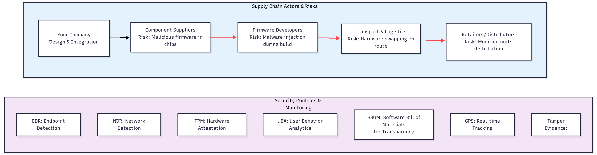
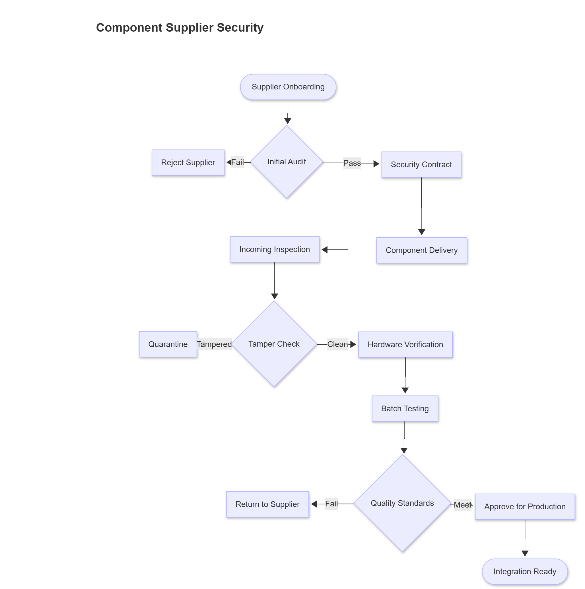
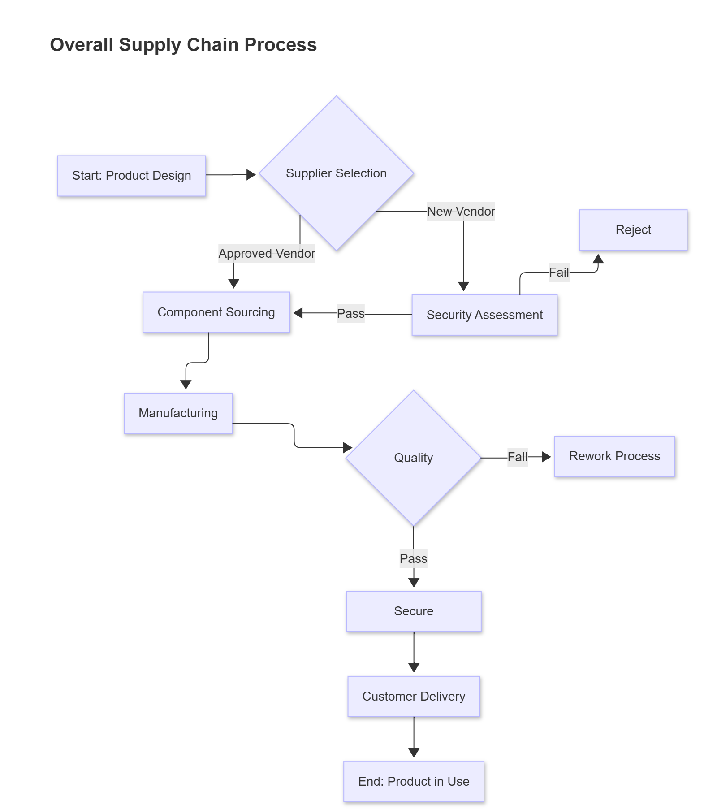

# Week 6 Exercise - Security Engineering

**Student:** Muhammad Zaeem Sarfraz  
**University:** University of Vaasa  
**Course:** Security Engineering IC00AJ63-3003  
**Student No:** x8435325  

---

## Task 1: Secure Running Environment

**Chosen Concepts:** Container and Virtualization  

---

### **Container**
 
Containers package applications and their dependencies into isolated environments that run on a shared operating system kernel. They ensure consistency across different systems by allowing the same container to run anywhere, regardless of the underlying infrastructure. Tools like Docker and Podman make deploying and managing containers straightforward and efficient.  

**Security Capabilities:**  
- Provide process and file system isolation using namespaces and control groups.  
- Limit access to host resources and system files through capabilities and permission controls.  
- Allow reproducible builds that reduce configuration drift and dependency conflicts.  

**Security Limitations:**  
- Containers share the same host kernel, so a kernel-level exploit can compromise all containers.  
- Misconfigured permissions or overly privileged containers can expose the host system.  
- Container images may include outdated or vulnerable software if not scanned regularly.  

### **Virtualization**

Virtualization enables multiple virtual machines (VMs) to run on one physical server through a hypervisor such as KVM, VMware, or VirtualBox. Each VM includes its own operating system and virtualized hardware. This architecture improves resource utilization and allows complete separation between environments.  

**Security Capabilities:**  
- Provides strong isolation between VMs, making cross-system compromise difficult.  
- Supports secure sandboxing and testing environments for untrusted workloads.  
- Simplifies backup, recovery, and controlled patching of virtual systems.  

**Security Limitations:**  
- If the hypervisor is breached, every VM running on it can be compromised.  
- Virtual network misconfigurations may allow traffic leaks or side-channel attacks.  
- Requires careful monitoring to prevent resource exhaustion or VM sprawl, which weakens security posture.  

## Task 2: Supply Chain Attacks

### **Scenario Overview**

Your company designs and sells routers and networking accessories for both businesses and consumers. While the software and main assembly happen in-house, several components—such as chips, printed circuit boards (PCBs), and firmware—come from external partners. This creates multiple entry points for supply chain attacks where malicious actors can tamper with hardware, firmware, or software during production, transport, or update distribution.

To secure the supply chain, the company must identify its key actors, map potential risks, and implement both technical and organizational controls.

---

### **Key Supply Chain Actors**

1. **Your Company (Design & Integration)**  
   Responsible for product design, firmware development, and final assembly.

2. **Component Suppliers**  
   Provide chips, boards, antennas, and embedded modules sourced internationally.

3. **Firmware Development Partner**  
   External team maintaining parts of the operating software and updates.

4. **Transport and Storage Companies**  
   Handle physical shipment of router components and finished units.

---

### **Security Controls and Actions**

**1. Your Company**  
- Implement a **Secure Software Development Lifecycle (SSDLC)** with code signing, peer review, and automated static analysis.  
- Use **TPM** for hardware-based attestation to verify firmware integrity during boot.  
- Deploy **EDR (Endpoint Detection and Response)** internally to detect compromised development machines.  

**2. Component Suppliers**  
- Require **supplier audits** and contractual obligations for hardware origin tracing.  
- Use **tamper-evident packaging** and **batch-level verification** of received parts.  
- Conduct **random destructive testing** on batches to detect unauthorized chip modifications.  

**3. Firmware Development Partner**  
- Enforce **SBOM (Software Bill of Materials)** transparency for all third-party libraries.  
- Integrate **version control access control and monitoring** to detect unauthorized commits.  
- Use **NDR (Network Detection and Response)** to monitor build servers for abnormal data flows.  

**4. Transport and Storage**  
- Require **chain-of-custody documentation** for all shipments.  
- Add **GPS tracking** and tamper sensors for high-value or sensitive batches.  
- Conduct integrity checks upon arrival before devices are connected to the internal network.  

---

### **Points of Concern and Trade-offs**

- **Increased Costs:** Security audits, tracking, and testing add operational overhead.  
- **Supply Delays:** Stronger verification slows production and delivery timelines.  
- **Supplier Resistance:** Smaller suppliers may lack the resources to meet new requirements.  
- **Monitoring Overload:** EDR/NDR systems generate many alerts, requiring skilled analysts.  

These challenges require management support, clear communication with partners, and ongoing training for internal teams.

---
### Visuals

Below are flowcharts illustrating the supply chain process, onboarding checks, and security controls.

**Visual 1: Product Lifecycle / Supply Chain Steps**  

**Visual 2: Supplier Onboarding & Hardware Verification**  

**Visual 3: Supply Chain Actors & Security Controls**  

